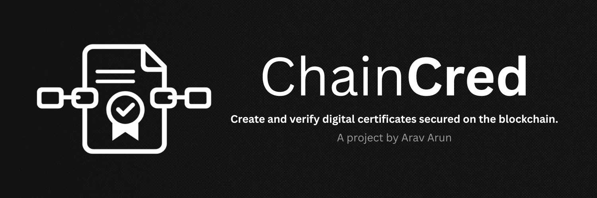
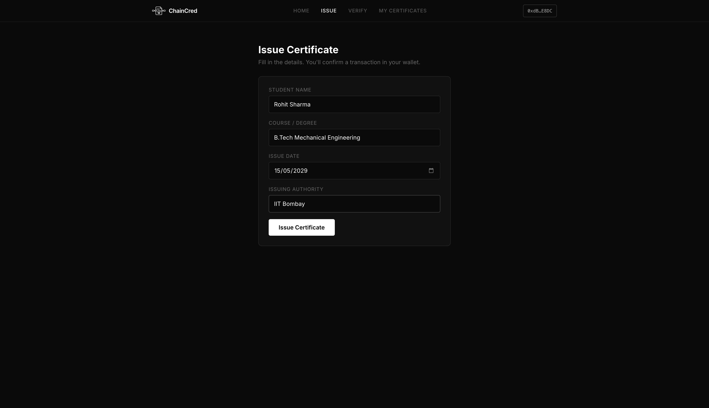
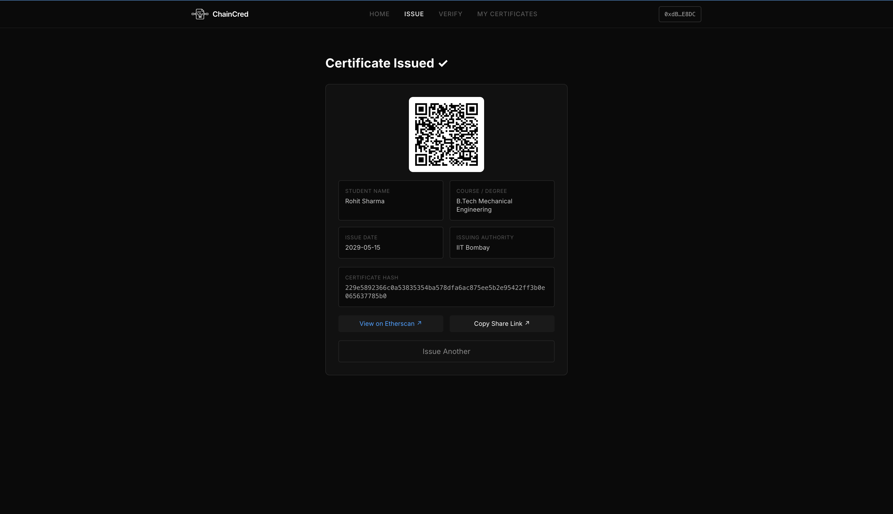
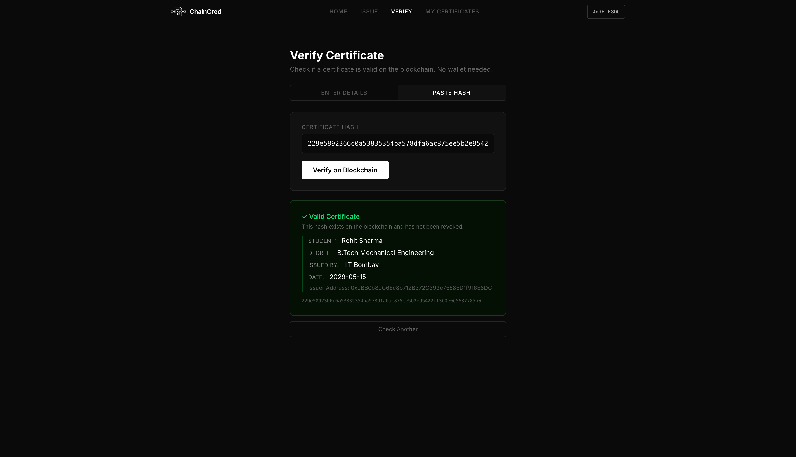
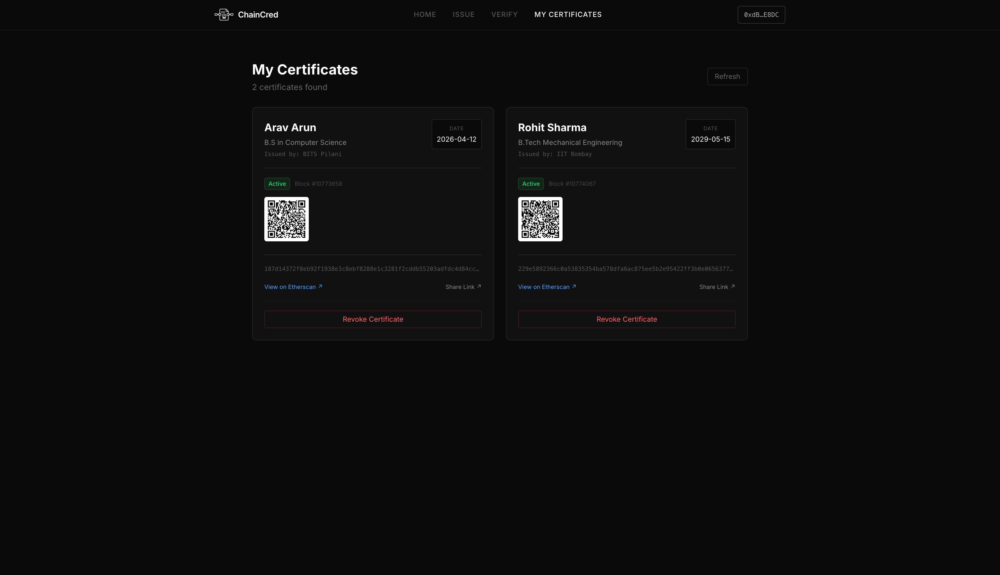
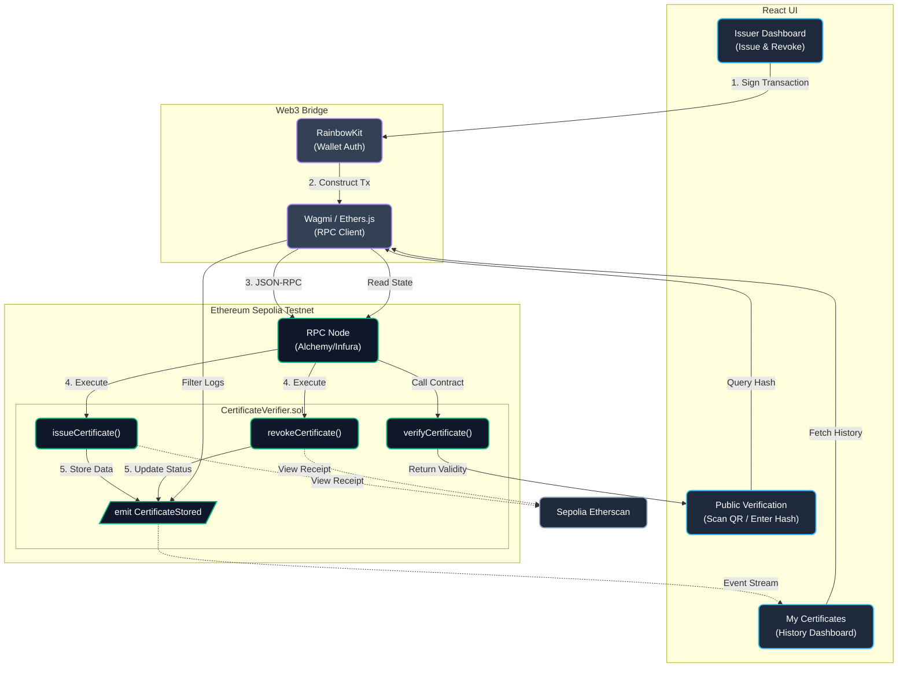

- ChainCred is a decentralized platform for issuing, verifying, and managing academic and professional credentials on the Ethereum blockchain. It eliminates the friction and fraud associated with traditional paper certificates by creating an immutable, cryptographic record of achievement.
- Users interact with ChainCred through a sleek, modern React frontend. Institutions can connect their Web3 wallets to mint tamper-proof digital certificates directly on-chain.  Once issued, students and employers can instantly verify the authenticity of a credential using a simple QR code or transaction hash without relying on any centralized verification authority.
- The platform handles everything from certificate issuance to on-chain revocation and features a unified dashboard for issuers to manage their entire history. The project is fully open-source, deployed on the Ethereum Sepolia Testnet.

---

## Tech Stack

### Core & Blockchain
- **Solidity**: Custom smart contracts (`CertificateVerifier.sol`) handling the core logic for issuing, verifying, and revoking certificates.
- **Ethereum (Sepolia Testnet)**: The base layer network for immutable data storage and decentralized consensus.
- **Ethers.js / Wagmi**: Handles all RPC communication, contract interactions, and event listening from the frontend.

### Frontend & UI
- **React**: Lightning-fast build tooling and component-based UI architecture.
- **Tailwind CSS v4**: Utility-first CSS framework combined with custom semantic classes for a premium, dark-mode-first aesthetic.
- **RainbowKit**: Seamless, out-of-the-box Web3 wallet connection providing a frictionless UX for both desktop and mobile users.

---

## Screenshots

| Home Page | Issue Certificate |
| :---: | :---: |
|  |  |
| **Verify Certificate Form** | **Certificate Verified Success** |
|  |  |
| **My Certificates Dashboard** | |
|  | |

---

## Architecture

- **Issuer Application**: The institution connects via RainbowKit to sign transactions. Data entered is securely hashed on the client-side before submission.
- **Smart Contract Execution**: The Solidity contract on the Sepolia Testnet receives the hash. Instead of storing bulky strings, it uses highly gas-efficient `emit CertificateStored` event logs.
- **Verification Portal**: A public user scans a QR code or enters a hash. The React frontend queries the Ethereum RPC node, reading the contract's state to instantly return the cryptographic validity and active/revoked status.
- **State Management**: The frontend listens and syncs in real-time with blockchain events, mapping raw hexadecimal logs into a human-readable dashboard.

---

## Key Features

- **Tamper-Proof Issuance**: Institutions can issue certificates that are permanently anchored to the Ethereum blockchain. Data is immutable and cannot be altered once confirmed.
- **Instant Cryptographic Verification**: Anyone can verify a credential in seconds using the certificate's unique hash or by scanning its auto-generated QR code.
- **On-Chain Revocation**: If a certificate is issued in error or compromised, the issuing address has the exclusive authority to permanently mark the hash as revoked on-chain.
- **My Certificates Dashboard**: A dashboard where issuers can view all their issued credentials, check live validity status (Active/Revoked), and monitor block confirmations.
- **Zero Friction Wallet Connect**: Powered by RainbowKit, users can connect via MetaMask, Coinbase Wallet, WalletConnect, and more with a single click.
- **Etherscan Integration**: 1-click links to view raw transaction data and block history directly on the Sepolia Etherscan block explorer.
- **Decentralized Storage Approach**: Instead of bloating state, ChainCred utilizes Ethereum event logs (`emit CertificateStored`) for highly gas-efficient data indexing and retrieval.

---

## Why I built this

- Whether it’s university degrees or corporate certifications, the system is fundamentally broken: it’s either heavily reliant on vulnerable, easily forged paper documents or locked behind slow, centralized institutional databases that require manual phone calls and emails to verify.
- The moment I began diving into Ethereum and smart contracts, I realized that blockchain was the perfect infrastructure for this exact problem. By anchoring credentials on-chain, I could build a system where trust is decentralized and verification is instantaneous.
